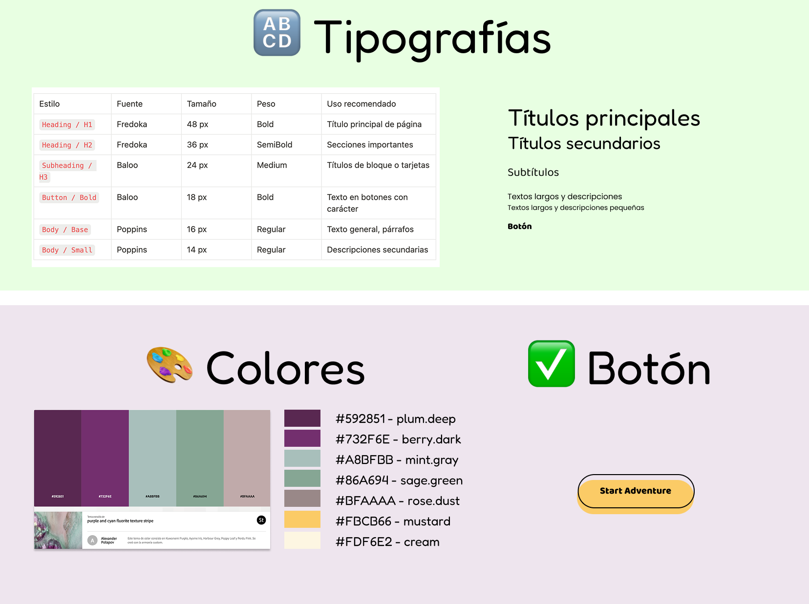

# ⚛️ FLUOR

> [!NOTE]
> **Proyecto Flúor - Tabla Periódica Colaborativa** ✨  
> Una exploración interactiva del elemento químico más fascinante

---

## 🌟 Descripción del Proyecto

Bienvenidas al repositorio de **Flúor**, nuestra propuesta dentro del **Collaborative Periodic Table Project** de Factoría F5. Esta es nuestra primera gran aventura grupal en el mundo del desarrollo front-end con HTML, CSS y JavaScript.

Cada sección fue diseñada por una integrante del equipo, lo que se refleja en la diversidad de ideas, estilos y recursos aplicados.

> [!TIP]
> Flúor no es solo un elemento químico. Es historia, tecnología, salud y curiosidad. Nuestra web lo explora desde distintas perspectivas, con el objetivo de informar, sorprender y entretener.

---

## 📁 Estructura del Sitio Web

Nuestro sitio web consta de **5 páginas principales**:

| Página | Descripción |
|--------|-------------|
| 🏠 **index.html** | Portal animado con un átomo interactivo que conecta al resto del sitio |
| 🔍 **donde-estoy.html** | Tarjetas 3D con usos contidianos del flúor y curiosidades científicas |
| 📜 **historia.html** | Narrativa animada estilo Star Wars sobre el descubrimiento del flúor y su impacto |
| 🎮 **jugamos.html** | Un juego interactivo tipo sopa de letras, para aprender jugando |
| 👩‍💻 **creadoras.html** | Galería de creadoras con tarjetas interactivas, animaciones y agradecimientos |

---

## 🛠️ Tecnologías Utilizadas

-  **HTML5** - Estructura y contenido
-  **CSS3** - Diseño visual: tipografías, colores, layout, animaciones, gradientes, flexbox y grid
-  **JavaScript**:
  - Interacciones personalizadas con addEventListener
  - Librerías: SweetAlert2, fireworks-js, howler.js para sonido
  - Efectos animados como el átomo, sopa de letras, tarjetas 3D y lluvia de corazones

> Además, integramos **Figma** para el diseño visual y la planificación de prototipos

### 💡 Funcionalidades Destacadas por página

- 🏠 **Página principal index/¿Cómo soy?**: Átomo con electrones en movimiento que enlazan al resto de páginas, y con efecto visual fluorescente

- 🔍 **¿Dónde Estoy?**: Tarjetas 3D con efecto flip, animación de destello y modal con curiosidad sobre fluorescencia y sonido

- 📜 **Mi historia**: Texto animado en formato de apertura cinematográfica con audio e inspiración galáctica y un quiz con efectos y sonido

- 🎮 **¿Jugamos?**: Juego de sopa de letras 20x20 con detección bidireccional de palabras y algoritmos para definir la lógica del juego

- 👩‍💻 **Creadoras**:

  - Tarjetas con imágenes generadas con IA al frente y frases personales detrás

  - Lluvia de corazones al voltear las tarjetas

  - Animación brillante de fluorita para cerrar con emoción

---

## 🗂️ Organización del Proyecto

Desde el inicio, decidimos trabajar de forma **organizada y colaborativa**:

### 🎨 Diseño y Planificación

- :white_check_mark: Creamos un **prototipo en Figma** para decidir la apariencia de nuestras páginas

*Wireframes y mockups iniciales diseñados en Figma*
- :white_check_mark: Definimos una **estructura de carpetas clara**: `img/`,`assets/`, `css/`, `js/`, `pages/`, etc.

### 👥 Gestión de Equipo

- :arrows_counterclockwise: **GitHub** para versionado y gestión de tareas
- :clipboard: **Tablero Kanban** para organizar tareas, milestones y deadlines
- :speaking_head: **Standups diarios** para compartir avances, bloqueos y aprendizajes

> [!IMPORTANT]
> **Principio clave**: Fomentamos siempre la ayuda mutua y el respeto al ritmo de cada compañera

---

## 🎨 Recursos y Créditos

Agradecemos profundamente a las plataformas, autores y comunidades que comparten recursos libres o de uso gratuito, los cuales han enriquecido enormemente nuestro proyecto.

### 🖼️ Recursos Visuales y Multimedia

- **Tipografías**:  
  - [Fredoka](https://fonts.google.com/specimen/Fredoka), [Baloo 2](https://fonts.google.com/specimen/Baloo+2), [Poppins](https://fonts.google.com/specimen/Poppins) — vía [Google Fonts](https://fonts.google.com)
- **Imágenes**:  
  - [Freepik](https://www.freepik.es), [Google Images](https://www.google.com/imghp)  
  - Imágenes de las creadoras generadas por IA con Apple Image Playground 
  - Imagen central del símbolo del flúor generada con ayuda de **ChatGPT**
- **GIFs animados**:  
  - [GIPHY](https://giphy.com)  

- **Vídeo de introducción**:  
  - [Vídeo del espacio](https://www.freepik.es/video-gratis/cielo-estrellado-noche_3544997) por *BaldasaridStock* vía Freepik
- **Iconografía**:  
  - Iconos de volumen del autor **@FACH**, familia *Generic black fill*:
    - [Icono de vocero](https://www.freepik.es/icono/vocero_11620784)  
    - [Icono de sonido apagado](https://www.freepik.es/icono/sonido-apagado_11620807)

### 🔊 Recursos Sonoros

- [Incorrect buzzer retro](https://freesound.org/people/EtherAudio/sounds/750933/)  
  por [EtherAudio](https://freesound.org/people/EtherAudio/) | Licencia: [CC BY 4.0](https://creativecommons.org/licenses/by/4.0/)

- [Space Journey Through Nebulae and Galaxy](https://freesound.org/s/731238/)  
  por [Universfield](https://freesound.org/people/Universfield/) | Licencia: [CC BY 4.0](https://creativecommons.org/licenses/by/4.0/)

### 📦 Librerías y Herramientas

- [`SweetAlert2`](https://sweetalert2.github.io/) – Modales personalizados
- [`howler.js`](https://howlerjs.com/) – Reproducción avanzada de audio
- [`fireworks-js`](https://fireworks.js.org/) – Efectos de fuegos artificiales
- Variables CSS, `@keyframes`, `transform` y `perspective` para animaciones visuales

### 🎓 Fuentes de Aprendizaje e Inspiración

- **YouTube**:  
  - [@ninoslab](https://www.youtube.com/@ninoslab)  
  - [CódigoWeb](https://www.youtube.com/c/CódigoWeb)  
  - [@midudev](https://www.youtube.com/@midudev)
- **Inspiración visual**:  
  - Animación estilo *Star Wars*  
  - Tarjetas coleccionables 3D  
  - Interfaces sci-fi con efectos neón
- **Recursos de desarrollo adicionales**:
 - [CSS-Tricks](https://css-tricks.com/) – Técnicas avanzadas de CSS Grid y Flexbox
 - [MDN Web Docs](https://developer.mozilla.org/) – Documentación completa de Touch Events
 - [StackOverflow](https://stackoverflow.com/) – Soluciones a desafíos específicos de JavaScript

---

## 🚀 Posibles Futuras Mejoras

Aunque estamos orgullosas del resultado, nos gustaría seguir mejorando el proyecto. Algunas de las ideas que nos encantaría implementar en próximas versiones incluyen:

- 🏠 **Página principal index/¿Cómo soy?**: Representar el átomo de flúor en **3D**, con movimientos más realistas y profundidad espacial para simular mejor su estructura atómica.

- 🔍 **Página "¿Dónde Estoy?"**:
  - Incorporar efectos visuales avanzados, como partículas flotantes, transiciones más elaboradas y desplazamiento con efecto parallax
  - Añadir sonido personalizado, con música ambiental, efectos únicos para cada tarjeta y transiciones auditivas
  - Desarrollar interactividad enriquecida, como mini-juegos integrados, tooltips informativos y animaciones activadas por scroll

- 📜 **Página "Historia"**: Configurar la sección del quiz para que las preguntas aparezcan una a una de forma dinámica, mejorando la claridad y usabilidad del juego.

- 👩‍💻 **Página "Creadoras"**: Añadir efectos al texto de las tarjetas, como animaciones sutiles o brillos que refuercen el carácter lúdico y visual de esta sección.

- 🎮 **Página "¿Jugamos?"**: Añadir múltiples niveles de dificultad con tableros de 15x15 y 25x25, palabras en diagonal, añadir un sistema de puntuación con tiempo, guardado de progreso de partidas y añadir efectos visuales y sonoros.

### Mejoras generales del sitio:

- **Optimización del rendimiento**, implementando carga diferida de imágenes, compresión de archivos y minimización de recursos

- **Ampliar la accesibilidad y adaptabilidad móvil**, garantizando una experiencia fluida y agradable en una mayor variedad de dispositivos

---

## 👩🏽‍🏫👩🏻‍🏫👩🏼‍🏫👩🏾‍🏫👩🏽‍🏫 Equipo de Desarrollo

| Desarrolladora | GitHub | LinkedIn |
|----------------|--------|----------|
| **Camila Arenas** | [GitHub](https://github.com/mcarenashd) | [LinkedIn](https://www.linkedin.com/in/mcarenash) |
| **Gema Yébenes** | [GitHub](https://github.com/gemayc) | [LinkedIn](https://www.linkedin.com/in/gema-yebenes-83b6a6100/) |
| **Mariana Moreno** | [GitHub](https://github.com/MarianaMH1195) | [LinkedIn](https://www.linkedin.com/in/mariana-moreno-henao-70305a16b/) |
| **Olga Ramírez** | [GitHub](https://github.com/olgararo) | [LinkedIn](https://www.linkedin.com/in/olga-ramirez-rodriguez/) |
| **Priscelis Codrington** | [GitHub](https://github.com/priscelis) | [LinkedIn](https://www.linkedin.com/in/priscelis-codrington-5195b0206/) |

---

## 🌐 Demo en Vivo

> [!TIP]
> ### :point_right: Ver el proyecto publicado
> 
> :link: **[Accede a nuestra web en GitHub Pages](https://mcarenashd.github.io/fluor/)**

---

**Gracias por visitar nuestro proyecto – esperamos que te guste tanto como a nosotras crearlo** :sparkles:

*Hecho con :purple_heart: por el equipo Flúor*

